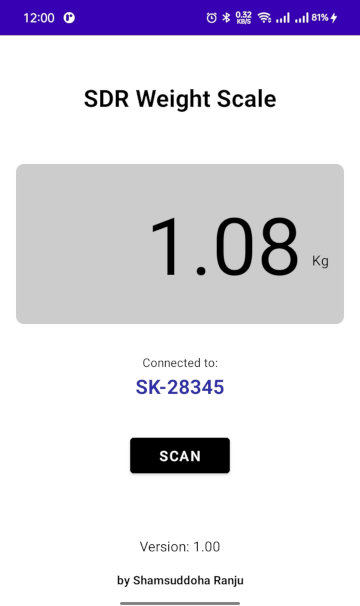

# WeightScale-BLE-Android
Android App to Connect to Your ESP32 BLE Weight Scale
<br><br>


<br><br>

**Introduction:**

In an earlier article, we built a [smart Weight Scale using ESP32 microcontroller](https://github.com/sdranju/WeightScale-ESP32-BLE), a load cell sensor and Bluetooth Low Energy (BLE) to broadcast weight data. Now, it's time to create an Android app that can connect to our DIY scale and display the weight measurements. It will allow you to easily monitor your weight progress and integrate it with other health and fitness appliances.

This Android application is designed to connect to our DIY scale (as well as any BLE weight scale that follows GATT standards) and display the weight measurements on your Android device. The app handles BLE permissions, auto scanning, connecting to the scale and updating the UI with the received weight data.
<br><br>

**Features**

 - Connect to the standard BLE weight scale including our ESP32 DIY scale
 - Display weight measurements
 - Auto scanning and show connected device's name
 - Support for different weight units (kg/lbs)
<br><br>

**Prerequisites**

 - Android Studio IDE installed
 - Basic knowledge of Android app development (activities, layouts, broadcasts, etc.)
 - A BLE weight scale (refer to the ESP32 BLE Weight Scale project for instructions)
<br><br>

**Getting Started**

1. Clone the repository:

`git clone https://github.com/sdranju/WeightScale-BLE-Android.git`

2. Open the project in Android Studio
 - Build and run the app on your Android device.
 - Grant the required permissions when prompted.
 - Ensure that your ESP32 weight scale is powered on and broadcasting weight data.
 - App will auto scan at start and connect to the BLE scale or tap the "Scan" button in the app to initiate scanning for the weight scale device.
 - Once connected, the app will display the weight measurements, unit and the name of the connected device.
<br><br>

**Code Structure**

 - `MainActivity.java`: Main activity that handles the app lifecycle, BLE permissions, scanning and UI updates.
 - `BluetoothHandler`.java: Handles BLE communication with the weight scale device using the Blessed library.
 - `WeightMeasurement`.java: Data class representing a weight measurement.
 - `WeightUnit.java`: Enum representing weight units (kg/lbs).
<br><br>

**Key Sections of the App**

*1: Handle BLE Permissions and Bluetooth Adapter State*

In the MainActivity.java, handle the required permissions for BLE scanning and Bluetooth adapter state changes. This includes requesting permissions, enabling Bluetooth, and checking location services.

```java
// Request permissions
private void checkPermissions() { ... }

// Check if Bluetooth is enabled
private boolean isBluetoothEnabled() { ... }

// Handle adapter state changes
private final BluetoothCentralManagerCallback bluetoothCentralManagerCallback = new BluetoothCentralManagerCallback() {
    @Override
    public void onBluetoothAdapterStateChanged(int state) {
        if (state == BluetoothAdapter.STATE_ON) {
            // Bluetooth is on, start scanning
            startScan();
        }
    }
};
```

*2: Implement BLE Scanning and Connection*

Use the BluetoothCentralManager from the Blessed library to scan for BLE peripherals and connect to your weight scale device.
```java
private void startScan() {
    central.scanForPeripheralsWithServices(new UUID[]{
        BluetoothHandler.WSS_SERVICE_UUID
    });
}

private final BluetoothCentralManagerCallback bluetoothCentralManagerCallback = new BluetoothCentralManagerCallback() {
    @Override
    public void onDiscoveredPeripheral(@NotNull BluetoothPeripheral peripheral, @NotNull ScanResult scanResult) {
        central.stopScan();
        central.connectPeripheral(peripheral, peripheralCallback);
    }
};
```

*3: Initialize the BluetoothHandler*

In your MainActivity, initialize the BluetoothHandler class, which handles the BLE communication with the weight scale device.
```java
private void initBluetoothHandler() {
    BluetoothHandler.getInstance(getApplicationContext());
}
```

*4: Handle Weight Data from BLE*

Implement a BroadcastReceiver to handle the weight data sent from the BluetoothHandler class. Update the UI with the received weight measurement.
```java
private final BroadcastReceiver weightDataReceiver = new BroadcastReceiver() {
    @Override
    public void onReceive(Context context, Intent intent) {
        WeightMeasurement measurement = (WeightMeasurement) intent.getSerializableExtra(BluetoothHandler.MEASUREMENT_WEIGHT_EXTRA);
        if (measurement != null) {
            weightDisplay.setText(String.format(Locale.ENGLISH, "%.2f", measurement.weight));
            unit.setText(measurement.unit.toString());
            String peripheralAddress = intent.getStringExtra(BluetoothHandler.MEASUREMENT_EXTRA_PERIPHERAL);
            BluetoothPeripheral peripheral = getPeripheral(peripheralAddress);
            connectedDeviceName.setText(peripheral.getName());
        }
    }
};
```
<br>

**Conclusion**

With this Android app, you can now seamlessly connect to your ESP32 BLE weight scale and display the weight measurements on your Android device. The app handles BLE permissions, scanning, connecting to the scale, and updating the UI with the received weight data. You can further enhance the app by adding features like weight tracking, graphing, and integrating with other health and fitness apps.
Enjoy taking control of your weight management with this custom-built solution!
<br><br>

**Contributing**

Contributions are welcome! If you find any issues or have suggestions for improvement, please open an issue or submit a pull request.
<br><br>

**Related Project**

Smart Weight Scale with ESP32 and Bluetooth BLE: https://github.com/sdranju/WeightScale-ESP32-BLE
<br><br>

**Acknowledgments**

Welie Blessed library for providing a robust and easy-to-use Android BLE library.
